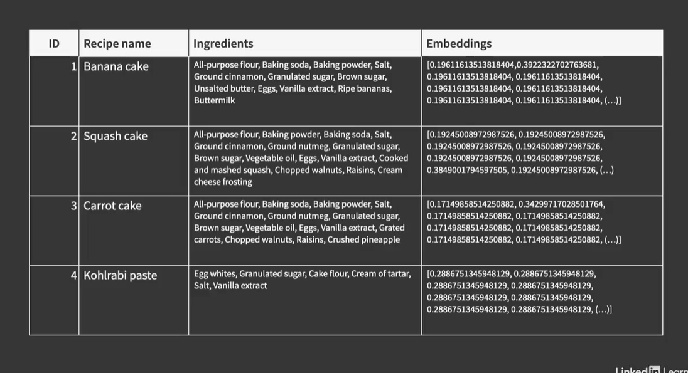
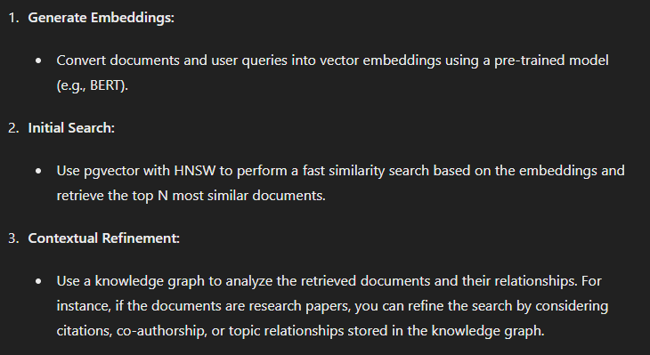
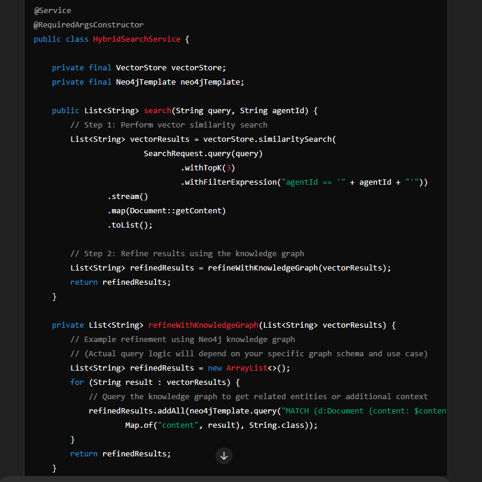

# Step 1 
- map the information and save in my own database

# Step 2
- embed the information in a vector space and save it in my own database in the same table as the information

# Step 3
- get the prompt and embed it in the same way

# Step 4
- use similarity search to find the most similar information in the database

Use Vector Databases for Initial Search:

Perform an initial similarity search using vector embeddings to quickly narrow down relevant items.
Refine Results with Knowledge Graphs:

Use the results from the vector search to traverse a knowledge graph, providing additional context and refining the search based on relationships and semantic information.

- A knowledge graph can enhance and add context to the results you obtain from your vector similarity search.

# Vector Similarity Search
- Purpose: Finds documents that are similar to the query based on embeddings.
- Mechanism: Uses algorithms like `HNSW` to quickly find top-k nearest neighbors in a high-dimensional space.
- Example: Given a query about "machine learning," it retrieves documents that are similar in content to the query.

# Knowledge Graph
- Purpose: Provides additional context and relationships between entities that go beyond pure content similarity.
- Mechanism: Represents data as a graph where nodes are entities (e.g., documents, authors, topics) and edges represent relationships (e.g., "authored by," "related to").
- Example: After retrieving documents about "machine learning," it can identify key topics, related authors, or important subfields related to the initial results.

## Combining Both Approaches
- Initial Search: Use vector similarity to get a list of documents that are closely related to the query.
- Refinement: Use the knowledge graph to:
1. Add more context to the results.
2. Filter or prioritize results based on relationships.
3. Discover additional related entities that are not captured by the similarity search alone.